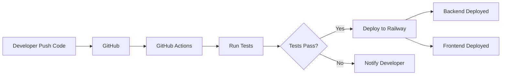

# 🚀 Panduan Deployment CI/CD - PesantrenKu

Dokumentasi lengkap untuk setup CI/CD menggunakan GitHub Actions dan Railway.

## 📋 Daftar Isi

- [Prasyarat](#prasyarat)
- [Setup Git dan GitHub](#setup-git-dan-github)
- [Setup Railway](#setup-railway)
- [Setup GitHub Actions](#setup-github-actions)
- [Environment Variables](#environment-variables)
- [Deployment Manual](#deployment-manual)
- [Monitoring dan Troubleshooting](#monitoring-dan-troubleshooting)

---

## 🔧 Prasyarat

Sebelum memulai, pastikan Anda telah memiliki:

1. **Git** - [Download Git](https://git-scm.com/downloads)
2. **Akun GitHub** - [Daftar di GitHub](https://github.com/signup)
3. **Akun Railway** - [Daftar di Railway](https://railway.app/)
4. **Node.js 18+** - [Download Node.js](https://nodejs.org/)

---

## 📦 Setup Git dan GitHub

### 1. Install Git

Download dan install Git dari [git-scm.com](https://git-scm.com/downloads)

Verifikasi instalasi:
```bash
git --version
```

### 2. Konfigurasi Git

```bash
git config --global user.name "Nama Anda"
git config --global user.email "email@example.com"
```

### 3. Inisialisasi Repository

Buka terminal di folder project (`d:\PesantrenKu`):

```bash
# Inisialisasi git
git init

# Tambahkan semua file
git add .

# Buat commit pertama
git commit -m "Initial commit: PesantrenKu project"
```

### 4. Buat Repository di GitHub

1. Buka [github.com](https://github.com) dan login
2. Klik tombol **"+"** di pojok kanan atas → **New repository**
3. Isi detail repository:
   - **Repository name**: `pesantrenku`
   - **Description**: `Sistem Manajemen Pesantren`
   - **Visibility**: Pilih **Private** atau **Public**
   - **JANGAN centang** "Initialize this repository with a README"
4. Klik **Create repository**

### 5. Push ke GitHub

Setelah repository dibuat, jalankan perintah berikut:

```bash
# Tambahkan remote repository
git remote add origin https://github.com/USERNAME/pesantrenku.git

# Push ke GitHub
git branch -M main
git push -u origin main
```

Ganti `USERNAME` dengan username GitHub Anda.

---

## 🚂 Setup Railway

### 1. Buat Akun Railway

1. Buka [railway.app](https://railway.app/)
2. Klik **"Start a New Project"**
3. Login dengan GitHub (recommended)

### 2. Buat Project Baru

1. Klik **"New Project"**
2. Pilih **"Deploy from GitHub repo"**
3. Pilih repository `pesantrenku`
4. Railway akan otomatis detect dan setup project

### 3. Setup Backend Service

1. Railway akan membuat service otomatis
2. Rename service menjadi **"backend"**
3. Klik service backend → **Settings**
4. Di bagian **Root Directory**, isi: `backend`
5. Di bagian **Custom Start Command**, isi: `node server.js`

### 4. Setup Frontend Service

1. Klik **"+ New"** → **"GitHub Repo"**
2. Pilih repository yang sama (`pesantrenku`)
3. Rename service menjadi **"frontend"**
4. Klik service frontend → **Settings**
5. Di bagian **Root Directory**, isi: `frontend`
6. Di bagian **Custom Start Command**, isi: `npm run preview -- --host 0.0.0.0 --port $PORT`

### 5. Setup Database (MySQL)

1. Klik **"+ New"** → **"Database"** → **"Add MySQL"**
2. Railway akan provision MySQL database
3. Copy connection details dari **Variables** tab

### 6. Setup Environment Variables

#### Backend Environment Variables:

Klik service **backend** → **Variables** → klik **"+ New Variable"**

Tambahkan variables berikut:

```env
NODE_ENV=production
PORT=5000

# Database
DB_HOST=[MYSQL_HOST dari Railway]
DB_PORT=[MYSQL_PORT dari Railway]
DB_USER=[MYSQL_USER dari Railway]
DB_PASSWORD=[MYSQL_PASSWORD dari Railway]
DB_NAME=[MYSQL_DATABASE dari Railway]

# JWT
JWT_SECRET=your-super-secret-jwt-key-change-this-in-production
JWT_EXPIRES_IN=7d

# CORS (isi dengan URL frontend dari Railway)
CORS_ORIGIN=https://your-frontend.up.railway.app
```

**Cara mendapatkan Database credentials:**
1. Klik service **MySQL** di Railway
2. Klik tab **Variables**
3. Copy nilai dari: `MYSQL_HOST`, `MYSQL_PORT`, `MYSQL_USER`, `MYSQL_PASSWORD`, `MYSQL_DATABASE`

#### Frontend Environment Variables:

Klik service **frontend** → **Variables** → klik **"+ New Variable"**

```env
VITE_API_URL=https://your-backend.up.railway.app/api
```

**Cara mendapatkan Backend URL:**
1. Klik service **backend** di Railway
2. Klik tab **Settings**
3. Scroll ke **Networking** → klik **Generate Domain**
4. Copy URL yang muncul (contoh: `https://your-backend.up.railway.app`)
5. Tambahkan `/api` di akhir URL

### 7. Import Database Schema

1. Klik service **MySQL** → **Data**
2. Klik **"Connect"** untuk buka MySQL client
3. Copy isi file `backend/database/schema.sql`
4. Paste dan execute di MySQL client

Atau gunakan Railway CLI:

```bash
# Install Railway CLI
npm install -g @railway/cli

# Login ke Railway
railway login

# Link project
railway link

# Connect ke database
railway run mysql -h [MYSQL_HOST] -u [MYSQL_USER] -p < backend/database/schema.sql
```

---

## ⚙️ Setup GitHub Actions

### 1. Dapatkan Railway Token

1. Buka [railway.app/account/tokens](https://railway.app/account/tokens)
2. Klik **"Create New Token"**
3. Beri nama: `GitHub Actions CI/CD`
4. **Copy token** (hanya muncul sekali!)

### 2. Setup GitHub Secrets

1. Buka repository di GitHub
2. Klik **Settings** → **Secrets and variables** → **Actions**
3. Klik **"New repository secret"**
4. Tambahkan secret:
   - **Name**: `RAILWAY_TOKEN`
   - **Secret**: [Paste Railway token dari step 1]
5. Klik **"Add secret"**

### 3. Verifikasi Workflow

File workflow sudah ada di `.github/workflows/railway-deploy.yml`

Workflow akan berjalan otomatis saat:
- Push ke branch `main` atau `master`
- Pull request ke branch `main` atau `master`

---

## 🔐 Environment Variables

### Backend (.env)

File ini **TIDAK** boleh di-commit ke Git (sudah ada di .gitignore).

```env
# Environment
NODE_ENV=development

# Server
PORT=5000

# Database
DB_HOST=localhost
DB_PORT=3306
DB_USER=root
DB_PASSWORD=your_password
DB_NAME=pesantren_db

# JWT
JWT_SECRET=your-secret-key-for-development
JWT_EXPIRES_IN=7d

# CORS
CORS_ORIGIN=http://localhost:5173
```

### Frontend (.env)

```env
VITE_API_URL=http://localhost:5000/api
```

---

## 🚀 Deployment Manual

### Deploy dengan Git Push

```bash
# Pastikan semua perubahan sudah di-commit
git add .
git commit -m "Update feature"

# Push ke GitHub (trigger CI/CD)
git push origin main
```

### Deploy dengan Railway CLI

```bash
# Install Railway CLI (jika belum)
npm install -g @railway/cli

# Login
railway login

# Link project
railway link

# Deploy backend
cd backend
railway up

# Deploy frontend
cd ../frontend
railway up
```

---

## 📊 Monitoring dan Troubleshooting

### Melihat Logs di Railway

1. Buka [railway.app](https://railway.app)
2. Pilih project Anda
3. Klik service (backend/frontend)
4. Klik tab **"Deployments"** → pilih deployment terakhir
5. Klik **"View Logs"**

### Melihat GitHub Actions Status

1. Buka repository di GitHub
2. Klik tab **"Actions"**
3. Pilih workflow run terakhir
4. Lihat detail setiap job

### Common Issues

#### 1. Database Connection Failed

**Solusi:**
- Pastikan environment variables database sudah benar
- Cek koneksi database di Railway (tab Variables)
- Restart service backend

#### 2. CORS Error di Frontend

**Solusi:**
- Pastikan `CORS_ORIGIN` di backend sesuai dengan URL frontend
- Update environment variable di Railway
- Redeploy backend

#### 3. Build Failed di GitHub Actions

**Solusi:**
- Cek logs di GitHub Actions
- Pastikan semua dependencies ada di package.json
- Pastikan tidak ada syntax error

#### 4. Railway Token Invalid

**Solusi:**
- Generate token baru di Railway
- Update `RAILWAY_TOKEN` secret di GitHub
- Re-run workflow

---

## 📝 Checklist Deployment

Sebelum deploy ke production, pastikan:

- [ ] Git sudah terinstall dan dikonfigurasi
- [ ] Repository sudah dibuat di GitHub
- [ ] Code sudah di-push ke GitHub
- [ ] Railway account sudah dibuat
- [ ] Project Railway sudah dibuat
- [ ] Backend service sudah di-setup
- [ ] Frontend service sudah di-setup
- [ ] MySQL database sudah provisioned
- [ ] Database schema sudah di-import
- [ ] Environment variables backend sudah diset
- [ ] Environment variables frontend sudah diset
- [ ] Railway token sudah dibuat
- [ ] GitHub secret `RAILWAY_TOKEN` sudah ditambahkan
- [ ] Domain sudah di-generate untuk backend dan frontend
- [ ] Test akses backend URL
- [ ] Test akses frontend URL
- [ ] Test login dan fitur utama

---

## 🔄 Workflow CI/CD



### Proses Deployment:

1. Developer push code ke GitHub
2. GitHub Actions detect push
3. Run tests untuk backend dan frontend
4. Jika tests pass, deploy ke Railway
5. Railway build dan deploy service
6. Service live di production

---

## 📞 Support

Jika mengalami masalah:

1. Cek logs di Railway
2. Cek workflow logs di GitHub Actions
3. Baca dokumentasi:
   - [Railway Docs](https://docs.railway.app/)
   - [GitHub Actions Docs](https://docs.github.com/en/actions)
4. Cek file `.env` dan environment variables

---

## 🎉 Selesai!

Selamat! CI/CD Anda sudah siap. Setiap kali Anda push code ke GitHub, aplikasi akan otomatis di-test dan deploy ke Railway.

**Next Steps:**
- Setup monitoring (Sentry, LogRocket, etc.)
- Setup custom domain
- Setup SSL certificate (otomatis di Railway)
- Setup database backup
- Setup notification (Slack, Discord, Email)
